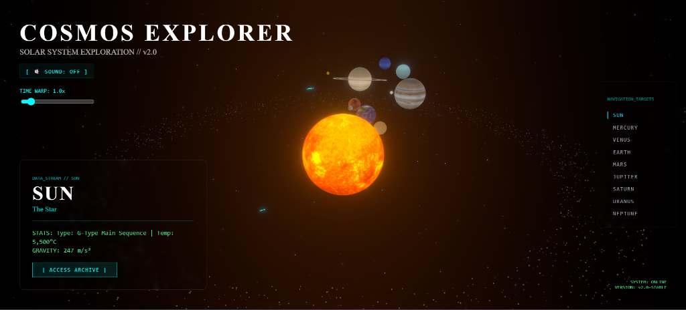
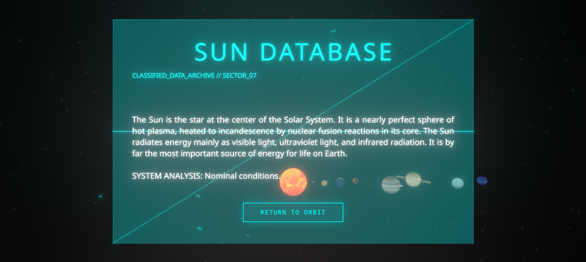
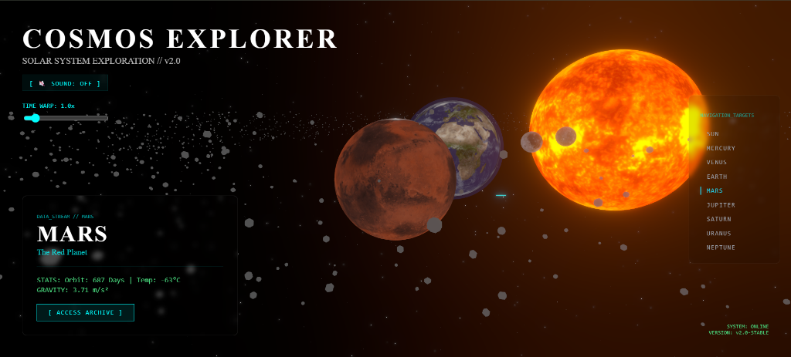

<div align="center">

  # 🪐 COSMOS EXPLORER
  
  ### An Interactive 3D Solar System Experience
  
  <p>
    <a href="https://github.com/kavi419">
      
    </a>
    <a href="https://www.linkedin.com/in/kavindu-nethmina-bb9731385/">
      
    </a>
  </p>

  <p>
    
    
    
    
  </p>

</div>

---

## 🚀 Overview

**Cosmos Explorer** is a cutting-edge web application that brings the Solar System to life right in your browser. Built using **React Three Fiber**, this project offers an immersive 3D experience where users can explore planets, manipulate time, and dive into deep space data.

From the fiery surface of the Sun to the icy rings of Saturn, every detail is rendered in real-time with stunning visual effects.

---

## 📸 Gallery

<div align="center">
  
</div>

<div align="center" style="display: flex; gap: 10px; justify-content: center;">
  
  
</div>

---

## ✨ Key Features

* **🌍 Interactive 3D Solar System:** Navigate freely through space with intuitive camera controls (Zoom, Pan, Rotate).
* **⏳ Time Warp Engine:** Control the speed of the universe! Speed up time to watch planets orbit or pause it completely.
* **🛰️ Real-time Orbiting Moons:** Watch **Europa** circle Jupiter and **Titan** orbit Saturn with realistic mechanics.
* **☄️ Dynamic Environment:** Features a dense **Asteroid Belt** between Mars and Jupiter, and periodic **Fiery Meteors** streaking across the sky.
* **📱 Fully Responsive UI:** A sleek, glassmorphism-based interface that works perfectly on both Desktop and Mobile devices.
* **🔍 Holographic Data Archives:** Seamlessly switch between 3D exploration and detailed informational archives for each planet.
* **🔊 Immersive Audio:** Background ambient space sounds to enhance the user experience.

---

## 🛠️ Tech Stack

* **Frontend Library:** React.js
* **3D Engine:** Three.js / React Three Fiber (@react-three/fiber)
* **Helpers:** React Three Drei (@react-three/drei)
* **Styling:** Tailwind CSS (Glassmorphism UI)
* **Animations:** GSAP (GreenSock) & Framer Motion
* **Build Tool:** Vite

---

## 💻 Getting Started

Follow these steps to run the project locally on your machine.

### Prerequisites
* Node.js installed (v16 or higher recommended)

### Installation

1.  **Clone the repository**
    ```bash
    git clone https://github.com/kavi419/cosmos-explorer.git
    cd cosmos-explorer
    ```

2.  **Install dependencies**
    ```bash
    npm install
    ```

3.  **Run the development server**
    ```bash
    npm run dev
    ```

4.  Open your browser and navigate to `http://localhost:5173`

---

## 🎮 Controls

| Action | Control |
| :--- | :--- |
| **Rotate Camera** | Left Mouse Click + Drag |
| **Zoom In/Out** | Mouse Scroll Wheel |
| **Pan Camera** | Right Mouse Click + Drag |
| **Select Planet** | Click on UI Navigation List |
| **Time Travel** | Use the "Time Warp" Slider |

---

## 👨‍💻 Author

**Kavindu Nethmina**

* **GitHub:** [@kavi419](https://github.com/kavi419)
* **LinkedIn:** [Kavindu Nethmina](https://www.linkedin.com/in/kavindu-nethmina-bb9731385/)

---

<div align="center">
  <i>Made with ❤️ and a love for the Cosmos.</i>
</div>